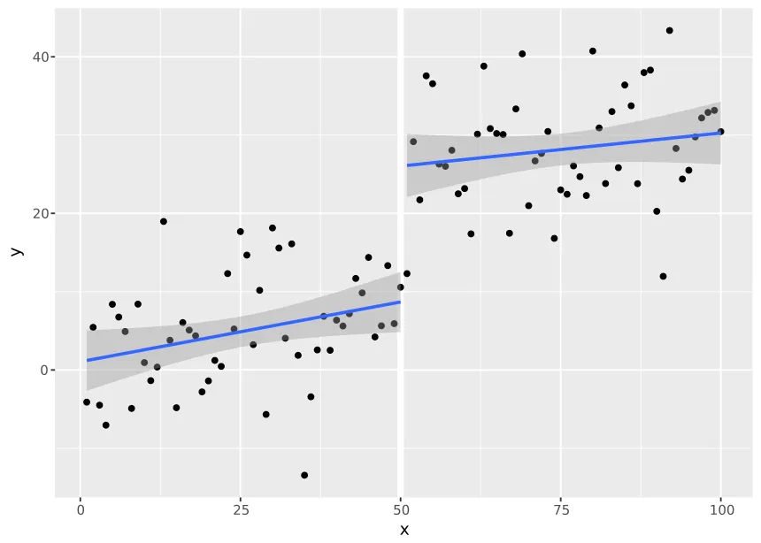
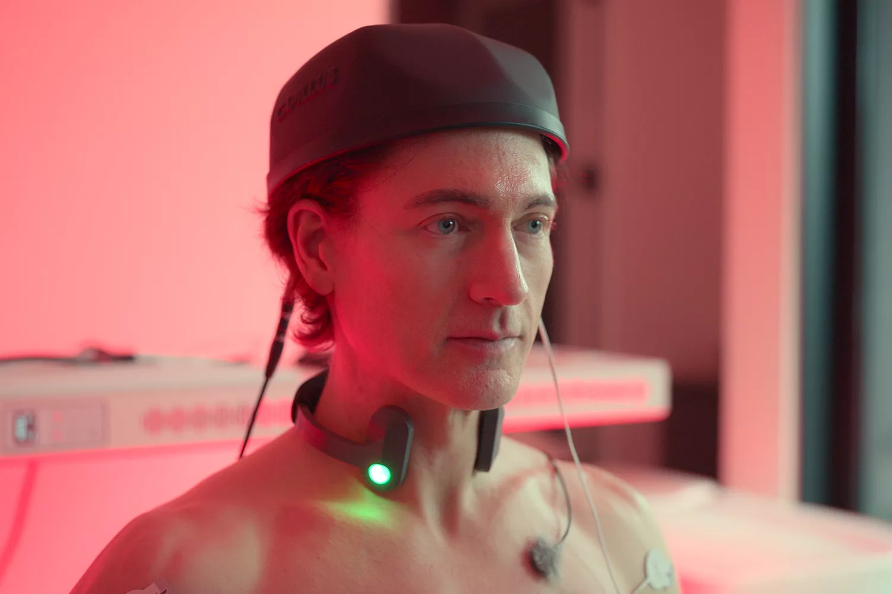

# Gym App

A personal training log that records every session, exercise, set and rep as its
own row. Lays the foundations for a pristine record precise enough to run
methodical analysis against.

## Motivations

### Record Keeping

Every app in this space records your workouts. What differs is the spirit of
the recording.

GitHub/git is the model I keep coming back to — the contribution graph runs back
to your first commit and stays there. Every commit carries both an author and a
committer, and can be signed with a key that says who actually made it. GitHub
has been running since 2008, and you can still open a repo and find the exact
change somebody made ten years ago, down to the line.

It's this forensic, immutable and permanent profile of what a person actually
did that I want to replicate in this app.

### Time Discontinuity Testing

Though I don't have any plans to start taking [over 100 pills a
day](https://time.com/6315607/bryan-johnsons-quest-for-immortality/) — I do
think there's a part of the longevity movement that has a case: testing your
body for changes pre-emptively, rather than waiting for something bad to happen.
Finding that out takes experiments. On a web app with enough users you'd run a
split test — half get the feature, half don't, and you measure the difference.
An individual doesn't have that luxury — we'd need at least two copies of
ourselves. What we have instead is time — we can hold a condition, change it,
and compare either side of the change. Economists call this a Regression
Discontinuity Design test, and where the thing you're cutting on is time rather
than a score or a threshold, Regression Discontinuity in Time (RDiT). In the
plot below, something happened at x = 50, and the jump between the two fitted
lines is the size of its effect.

A precise log can answer things a looser record can't — what eating or drinking
certain foods costs you, what a week off costs, what a stretch of low mood does
to training sessions. The longer-term ambition is a record precise enough to run
real analysis against (e.g. a regression holding known confounders constant, or
an interrupted time series around a change in routine). This will require
pristine data.

  
  
   
  <em>L: an RDiT — something happened at x = 50, and the jump between the two fitted lines is the size of its effect.</em>
   
  <em>R: Longevity influencer Bryan Johnson, who I'm sure would approve of this app</em>

### Ergonomics

The apps already out there are good. But no app built for everybody is ever
quite the right fit for anybody. This was my case when looking at the other apps
in this sector.

Hevy was the closest in spirit to this, and a genuinely good app — just not
mine. There was no coherent way to record the exact configuration of a machine,
whether the seat was on notch 2 or notch 3 — or how long I'd actually rested
between sets — and its Strava integration seemed to not backfill runs into the
same Hevy dataset.

Pre-AI, building something for your own use case rarely made sense — writing an
app from scratch most of the time took longer than bending yourself around one
that already existed. AI has changed that arithmetic — building bespoke tools
for individual use cases in many cases is now worth it.

## Next

* Mobile app.
* Food, sleep and bodyweight on the same timeline.
* Strava import, so runs and rides sit next to the lifting.
* Name that isn't boring

---

**Disclaimer.** Built for my own use. It has bugs and security holes and
unfinished corners, and nothing here has been hardened for wider use. Feel free
to use it or take bits of it, but it's an ad hoc personal app and isn't suitable
for much more than that at this stage.
